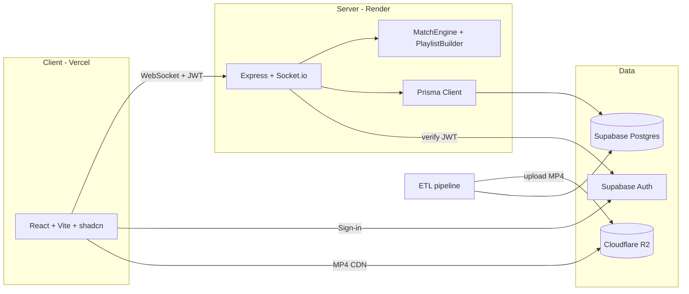

# Architecture

High-level overview of AniQuizz as deployed at [aniquizz.com](https://aniquizz.com).

## System overview

## Monorepo packages

### `apps/client`

React SPA deployed to Vercel (`apps/client` as project root).

| Area | Purpose |
| ---- | ------- |
| `src/pages/` | Routed views — Home, GameHub, Game, Profile, Admin, **Library**, legal pages |
| `src/features/` | Feature modules — auth, game, hub, friends, profile, admin, settings, **library** |
| `src/components/ui/` | shadcn/ui primitives |
| `src/lib/` | Supabase, socket, admin API, env, route prefetch |
| `vercel.json` | SPA rewrite, apex redirects, immutable asset cache |

Route-based code splitting (`React.lazy`) with skeleton fallbacks. Supabase and
socket helpers load on demand after first paint where possible.

### `apps/server`

Express + Socket.io on Render (Starter, Frankfurt). Binds `0.0.0.0:$PORT`.

| Area | Purpose |
| ---- | ------- |
| `src/core/` | HTTP bootstrap, `SocketManager`, JWT auth middleware, rate guards |
| `src/modules/game/` | `GameManager`, `gameHandlers`, `gameService`, **engine/** (`MatchEngine`, `PlaylistBuilder`, `RoundClock`, …) |
| `src/modules/lobby/` | Room create/join, settings, room list fan-out |
| `src/modules/chat/` | In-game chat (respects mute sanctions) |
| `src/modules/profile/` | Stats, public profiles, leaderboard stub |
| `src/modules/friends/` | Friend graph, presence, invites |
| `src/modules/admin/` | REST `/admin/*` — users, rooms, catalogue, stats, dev tools |
| `src/modules/anilist/` | Watched-list resolution for AniList mode |
| `src/modules/mal/` | MyAnimeList public API — username verify, animelist fetch, `idMal` catalogue mapping |
| `src/modules/lists/` | `listResolver` + `watchedPoolResolve` — one list provider per profile (AniList **or** MAL), cross-player union/intersection |
| `src/modules/catalogue/` | `libraryService` — browse meta, franchise tree, song search/detail |
| `src/routes/` | `/health`, `/library/*`, leaderboard HTTP stub |

Catalogue caches (`getAllAnimeNames`, choice candidates) warm at boot to reduce
cold-start latency on Render.

### `packages/shared`

Framework-agnostic types, socket event contracts (`events.ts`), game constants,
and **pure logic** — fuzzy matching, scoring, grading/medals, ranking, leveling,
Fisher–Yates selection. Unit-tested; imported by both client and server.

### `packages/database`

- `prisma/schema.prisma` + migrations — source of truth for Postgres
- `src/index.ts` — shared Prisma client, bot helpers
- `scripts/` — ETL pipeline (steps 1–4), export/import manual edits, R2 integrity scan, video repair

Media keys live in `Song.videoKey`; completed songs point at public R2 URLs.

## Identity & security

- **Socket handshake** verifies the Supabase JWT; `socket.data.userId` is the only trusted identity.
- **Banned users** are rejected at handshake; **muted users** cannot send chat (live sanction push via `profile:sanction_updated`).
- **Admin routes** require MODERATOR or ADMIN role from the database, not the client.
- **RLS** on Supabase tables — see [`docs/security/rls-audit.md`](./docs/security/rls-audit.md).

## Realtime flow: Standard match

1. Host creates/joins a lobby; settings stored server-side (`RoomSettings` / `GameConfig`).
2. Host starts — `PlaylistBuilder` selects songs (filters, difficulty, watched mode, QCM choices). In Watched + QCM/Mix, distractors use the same watched ids as the songs ([`docs/game/watched-qcm-choices.md`](./docs/game/watched-qcm-choices.md)). Watched pools resolve per player via AniList **or** MyAnimeList (one provider per profile), then union/intersection across the lobby.
3. Each round: server emits `round_start` (R2 key + start offset), collects `game:answer`, then `round_reveal`. Solo uses the full guess timer like multiplayer; optional early reveal via `game:skip_round` after at least one answer.
4. `MatchEngine` scores answers; anti-cheat rejects answers before reveal.
5. `game_over` persists stats/XP; solo medals computed from mastery ratio (`packages/shared` grading, integer-rounded thresholds — see [`docs/game/solo-medals.md`](./docs/game/solo-medals.md)).

## Music library (v26.2)

Read-only catalogue browse — no gameplay impact.

| Layer | Detail |
| ----- | ------ |
| **HTTP** | `GET /library/meta`, `/library/tree`, `/library/songs`, `/library/song/:id` — optional JWT (`optionalAuth`) for heard/unheard filters; rate-limited |
| **Server** | `libraryService.ts` — playable songs = `downloadStatus: COMPLETED` only (same rule as matches) |
| **Browse modes** | Default: franchise tree paginated by `Franchise.maxPopularity`. With `q` search: flat song pagination + `Anime.altNames` GIN index |
| **Client** | `/library` — filters, tree view, song drawer with video preview |
| **Shared** | `packages/shared/src/library.ts` — browse params, response types, `animeMatchesLibrarySearch()` |
| **DB** | Migration `20260712180000_library_franchise_popularity` — `Franchise.maxPopularity`, `Anime_altNames_gin_idx` |

## Watched lists — AniList & MyAnimeList (v26.2)

| Rule | Behaviour |
| ---- | --------- |
| **One provider per profile** | `Profile.anilistUsername` **XOR** `Profile.malUsername` — linking one clears the other at the app layer |
| **AniList** | Existing GraphQL sync → internal `Anime.id` |
| **MAL** | Official v2 `GET /users/{name}/animelist` with header `X-MAL-CLIENT-ID` only (no OAuth). Statuses: `watching`, `completed`, `on_hold` → catalogue via `Anime.idMal` |
| **Multi lobby** | Each player's pool resolved separately; host settings apply **union** or **intersection** on catalogue ids |
| **Gates** | Same min-pool threshold and opt-in global fallback as AniList-only Watched — see [`docs/game/watched-pool-threshold.md`](./docs/game/watched-pool-threshold.md) |
| **Env** | `MAL_CLIENT_ID` on server (Render prod + `apps/server/.env.example`) |
| **DB** | Migration `20260712200000_profile_mal_username` — `Profile.malUsername`, `Anime_idMal_idx` |

Shared helpers: `packages/shared/src/watchedList.ts` (`hasWatchedListLink`, `watchedListProvider`). Socket payloads expose `malUsername` on `GamePlayer` / `SocketData` alongside AniList.

## Environment

Each runnable package has its own `.env`. See [`.env.example`](./.env.example) and
per-package `.env.example` files for the required subset.

## Related docs

| Doc | Topic |
| --- | ----- |
| [`docs/game/solo-medals.md`](./docs/game/solo-medals.md) | Solo medal tiers, mastery bar, rounding fix |
| [`docs/game/watched-qcm-choices.md`](./docs/game/watched-qcm-choices.md) | Watched AniList QCM/Duo distractor pool |
| [`docs/game/watched-pool-threshold.md`](./docs/game/watched-pool-threshold.md) | Watched min-pool gates (AniList + MAL) |
| [`docs/admin/moderation.md`](./docs/admin/moderation.md) | Mute/ban behaviour |
| [`docs/security/delete-account.md`](./docs/security/delete-account.md) | RGPD account deletion flow |
| [`docs/security/rls-audit.md`](./docs/security/rls-audit.md) | Postgres RLS |
| [`docs/seo/google-search-console.md`](./docs/seo/google-search-console.md) | SEO checklist |
| [`docs/perf/baseline.md`](./docs/perf/baseline.md) | Performance snapshots |
| [`packages/database/README.md`](./packages/database/README.md) | Catalogue pipeline |
