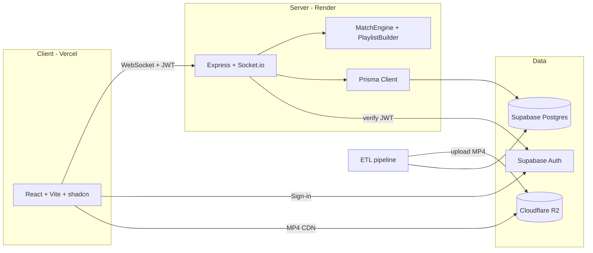

# Architecture

High-level overview of AniQuizz as deployed at [aniquizz.com](https://aniquizz.com).

## System overview

## Monorepo packages

### `apps/client`

React SPA deployed to Vercel (`apps/client` as project root).

| Area | Purpose |
| ---- | ------- |
| `src/pages/` | Routed views — Home, GameHub, Game, Profile, Admin, legal pages |
| `src/features/` | Feature modules — auth, game, hub, friends, profile, admin, settings |
| `src/components/ui/` | shadcn/ui primitives |
| `src/lib/` | Supabase, socket, admin API, env, route prefetch |
| `vercel.json` | SPA rewrite, apex redirects, immutable asset cache |

Route-based code splitting (`React.lazy`) with skeleton fallbacks. Supabase and
socket helpers load on demand after first paint where possible.

### `apps/server`

Express + Socket.io on Render (Starter, Frankfurt). Binds `0.0.0.0:$PORT`.

| Area | Purpose |
| ---- | ------- |
| `src/core/` | HTTP bootstrap, `SocketManager`, JWT auth middleware, rate guards |
| `src/modules/game/` | `GameManager`, `gameHandlers`, `gameService`, **engine/** (`MatchEngine`, `PlaylistBuilder`, `RoundClock`, …) |
| `src/modules/lobby/` | Room create/join, settings, room list fan-out |
| `src/modules/chat/` | In-game chat (respects mute sanctions) |
| `src/modules/profile/` | Stats, public profiles, leaderboard stub |
| `src/modules/friends/` | Friend graph, presence, invites |
| `src/modules/admin/` | REST `/admin/*` — users, rooms, catalogue, stats, dev tools |
| `src/modules/anilist/` | Watched-list resolution for AniList mode |
| `src/routes/` | `/health`, leaderboard HTTP stub |

Catalogue caches (`getAllAnimeNames`, choice candidates) warm at boot to reduce
cold-start latency on Render.

### `packages/shared`

Framework-agnostic types, socket event contracts (`events.ts`), game constants,
and **pure logic** — fuzzy matching, scoring, grading/medals, ranking, leveling,
Fisher–Yates selection. Unit-tested; imported by both client and server.

### `packages/database`

- `prisma/schema.prisma` + migrations — source of truth for Postgres
- `src/index.ts` — shared Prisma client, bot helpers
- `scripts/` — ETL pipeline (steps 1–4), export/import manual edits, R2 integrity scan, video repair

Media keys live in `Song.videoKey`; completed songs point at public R2 URLs.

## Identity & security

- **Socket handshake** verifies the Supabase JWT; `socket.data.userId` is the only trusted identity.
- **Banned users** are rejected at handshake; **muted users** cannot send chat (live sanction push via `profile:sanction_updated`).
- **Admin routes** require MODERATOR or ADMIN role from the database, not the client.
- **RLS** on Supabase tables — see [`docs/security/rls-audit.md`](./docs/security/rls-audit.md).

## Realtime flow: Standard match

1. Host creates/joins a lobby; settings stored server-side (`RoomSettings` / `GameConfig`).
2. Host starts — `PlaylistBuilder` selects songs (filters, difficulty, watched mode, QCM choices).
3. Each round: server emits `round_start` (R2 key + start offset), collects `game:answer`, then `round_reveal`.
4. `MatchEngine` scores answers; anti-cheat rejects answers before reveal.
5. `game_over` persists stats/XP; solo medals computed from mastery ratio (`packages/shared` grading).

## Environment

Each runnable package has its own `.env`. See [`.env.example`](./.env.example) and
per-package `.env.example` files for the required subset.

## Related docs

| Doc | Topic |
| --- | ----- |
| [`docs/admin/moderation.md`](./docs/admin/moderation.md) | Mute/ban behaviour |
| [`docs/security/rls-audit.md`](./docs/security/rls-audit.md) | Postgres RLS |
| [`docs/seo/google-search-console.md`](./docs/seo/google-search-console.md) | SEO checklist |
| [`docs/perf/baseline.md`](./docs/perf/baseline.md) | Performance snapshots |
| [`packages/database/README.md`](./packages/database/README.md) | Catalogue pipeline |
