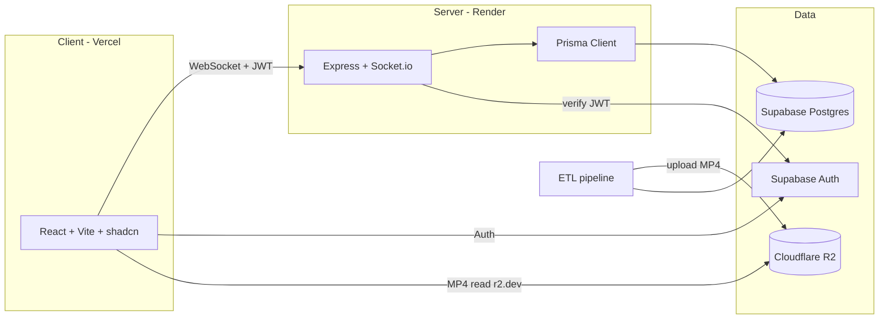

# Architecture

High-level overview of how AniQuizz is structured. For the phased refactor
roadmap, see [`PLAN.md`](./PLAN.md).

## System overview

## Packages

### `apps/client`

React + Vite single-page app deployed to Vercel.

- `src/pages` — routed pages (Home, GameHub, Game, Profile, Leaderboard, ...).
- `src/features` — feature modules (auth, game, hub, home, news, profile, settings).
- `src/components/ui` — shadcn/ui primitives.
- `src/lib` — cross-cutting clients (`supabase`, `socket`) and utilities.
- `src/index.css` — design system tokens (dark theme, gradients, animations).

### `apps/server`

Express + Socket.io back-end deployed to Render (Starter plan; no cold start).

- `src/core` — HTTP/Socket server bootstrap and the `SocketManager` dispatcher.
- `src/modules` — feature handlers (game, lobby, chat, profile, anilist).
- `src/modules/game/classes` — the game engine (`GameCore` + mode classes).
- `src/config` — security/CORS configuration.
- `src/utils` — logging and helpers.

### `packages/shared`

Framework-agnostic code shared by client and server: TypeScript types,
game constants, and **pure logic** (fuzzy matching, scoring, Fisher-Yates
shuffle, ranks). This package holds the business logic worth protecting with
unit tests.

### `packages/database`

- `prisma/schema.prisma` — the data model, under version control via migrations.
- `src/index.ts` — the shared Prisma client instance and re-exported types.
- `scripts/` — the ETL pipeline (AniList fetch, AnimeThemes fetch, load,
  media sync) and admin tools (reset, export/import edits, seed).

## Identity model

Players are identified by the `userId` carried in the Supabase JWT, not by
`socket.id` (which changes on reconnect). This makes scores, XP, friends and
stats reliably attachable and enables clean reconnection. JWT verification on
the Socket.io handshake is introduced in Phase 2.

## Data flow: a Standard match

1. A player creates or joins a room (lobby) over Socket.io.
2. The host starts the match; the server pre-builds the round playlist.
3. For each round the server streams a media key (resolved to an R2 URL on the
   client), collects answers, locks them, then reveals and scores.
4. At the end, results are persisted (stats, XP) through the Prisma client.

## Environment & configuration

Each runnable package reads its own `.env`. See [`.env.example`](./.env.example)
for the full reference and the per-package `.env.example` files for the exact
subset each one needs.
