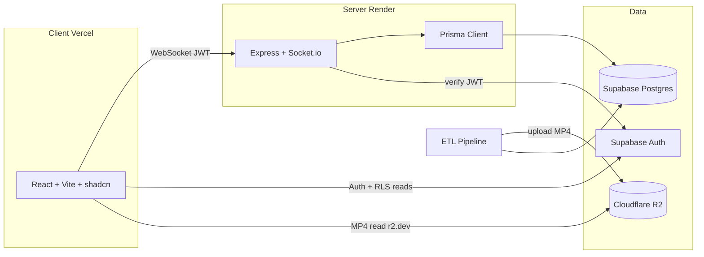
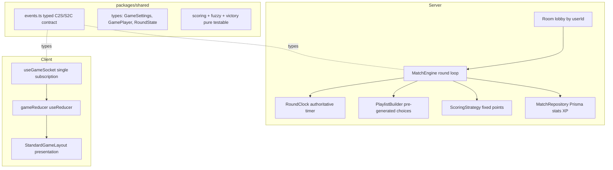

# AniQuizz Refactor Plan

Strategic refactor: keep solid business logic (song selection, fuzzy match, victory conditions, ETL pipeline, `packages/shared`, shadcn design system) but **rewrite the game engine** on healthy foundations (the old engine works but its foundations block features). Fresh repo, cleaned infra (R2 for media), and three finished features (XP, friends, leaderboard).

**Validated decisions:** new GitHub repo (`aniquizz`, old renamed `old-aniquizz`) / reuse Vercel + Render (Starter plan €7/mo, no cold-start) + Supabase + R2 creation / public `r2.dev` URL / regenerate catalogue via pipeline (no media migration) / Standard mode only (fixed points by answer type; AMQ-style speed mode later) / login required to play / keep Daily/Library placeholder pages as "coming soon" / mandatory review between each phase (commit + verify + pause).

**Local folders:** `old-AniQuizz/` = read-only reference · `aniquizz/` = new project workspace.

**Database target:** the agreed future-proof schema lives in `SCHEMA-TARGET.md` (design only; implemented across Phases 2/4/5/6/7). Refer to it for all schema decisions.

---

## Phase boundary protocol (mandatory)

At the end of each phase, **pause for review** before starting the next. Never start phase N+1 without explicit approval.

Checklist at every boundary:

1. **Phase checklist** — go through every item; mark done, partial, or deferred.
2. **Verify it still runs:**
   - `pnpm install` (if deps changed)
   - `pnpm build` (monorepo)
   - `pnpm dev` or targeted smoke test (`/health`, client loads, pipeline script if touched)
   - unit tests for the phase if already in place
3. **Git commit** — one commit per phase, clear message (`phase(N): 
`), only when explicitly requested at review (no mid-phase commits).
4. **Review summary** — what changed, how to test manually, watchouts, next phase.
5. **Pause** — wait for validation before phase N+1.

Branches: work on `main` or `refactor/phase-N-*`; confirm in Phase 0.

---

## Current engine diagnosis (to fix)

- Player identity keyed on `socket.id` (changes on reconnect) → lost scores, XP/friends/stats not reliably attachable. Root cause of most bugs.
- `any` and `@ts-ignore` everywhere (`settings: any`, dynamic props `timeTaken`/`wins`/`watchedIds`).
- God object `GameCore` (~520 lines: lobby + playlist + timers + votes + anilist + scoring + persistence), victory logic duplicated between `GameCore` and `StandardGame`.
- Anti-cheat leak: player answers broadcast to the whole room during guess; no answer lock.
- QCM variety bug: `prisma.anime.findMany({ take: 60 })` is not random and runs every round.
- Doubled DB queries in cascade + biased shuffle (`sort(() => 0.5 - Math.random())`).
- Client `Game.tsx` = god component (530 lines, ~40 `useState`, socket listeners re-subscribed every round → stale closures).
- Socket events = magic strings duplicated client/server, untyped.
- Finished matches never removed from `GameManager` memory.

---

## Target architecture

---

## Phase 0 — New repo & foundations

- Create empty GitHub repo via MCP (`aniquizz`).
- Monorepo structure pnpm + Turborepo (`apps/client`, `apps/server`, `packages/shared`, `packages/database`).
- Copy ONLY solid bricks: `packages/shared`, `packages/database` (schema + scripts), Standard server classes, `apps/client/src/components/ui`, features `auth`/`home`/`profile`, design system (`index.css`, tokens).
- Pro docs: `README.md`, `ARCHITECTURE.md`, `CONTRIBUTING.md`, `LICENSE`, `.env.example` per app.
- Unify Prisma to `6.x` everywhere (server 5.10.2 vs database 6.19.2 today).
- Initialize versioned Prisma migrations (`prisma migrate dev`) **as soon as schema lands** — initial schema under version control from commit 1 (no unversioned `db push`). Schema cleanup in Phase 4 via new migrations.
- Clean `.gitignore` + shared lint/format config.
- Fix broken `description` in `packages/database/package.json`.
- Easy dev workflow: single `pnpm dev`, complete `.env.example`, deterministic test-account seed (advanced test tooling in Phase 6).

**Cross-cutting convention (from now):** all code in English (identifiers, comments, logs, docs, commits); user-facing UI text stays French, isolated (i18n-ready). Lint rule + anti-French grep in CI (Phase 9).

---

## Phase 1 — Infra & R2 migration

- Cloudflare R2: bucket `aniquizz-videos`, public `r2.dev` URL, S3 API keys (manual setup; MCP R2 returned 403).
- Adapt `packages/database/scripts/4_sync_storage.ts`: Supabase Storage → R2 S3 client; parallel workers (`p-limit`); env flags.
- Adapt `packages/database/scripts/reset_all.ts`: empty R2 via `ListObjectsV2` + `DeleteObjects`.
- Pipeline improvements: `videoKey` (R2 object key) vs `sourceUrl` (AnimeThemes URL → R2 public URL after upload); zod validation on `data_step2.json`.
- Dev seed: `seed_dev_catalogue.ts` — 10 openings on R2 for playable dev loop without full catalogue regen (~1450 songs left `PENDING`).
- Client: `VITE_R2_PUBLIC_URL` via `apps/client/src/lib/video.ts` (no hardcoded Supabase Storage URL).
- Server CORS: `CLIENT_URL` env + `https://aniquizz.vercel.app`.
- **Deployments:** Vercel `VITE_R2_PUBLIC_URL` set; Render build fixed (monorepo root, `pnpm --filter aniquizz-server... build`, start `node apps/server/dist/index.js`) — see `render.yaml`.
- Prisma baseline resolved on live Supabase (`20260705000000_init`).
- Target schema designed in `SCHEMA-TARGET.md` (implementation in Phases 2/4/5).
- **Deferred:** full catalogue regeneration on R2 (`pipeline:build`) — run when ready; ~1229 songs need AnimeThemes relink from cache before worker can fetch them.

---

## Phase 2 — Security & identity

- Supabase JWT validation on server: Socket.io middleware in `SocketManager.ts` verifying `socket.handshake.auth.token` (JWT secret or `supabase.auth.getUser`) — never trust raw `userId`. Output: `socket.data.userId` as canonical identity.
- Login required to play: reject unauthenticated sockets on game actions; gate `/play` and `/game` client-side (redirect to login modal).
- Rate limiting on sensitive socket events (`game:answer`, `chat:sendMessage`, `lobby:create`).
- Boot-time env validation (zod) client + server; centralize all URLs in env vars.
- **Identity schema:** remove `Profile.id @default(uuid())` to align with the existing `handle_new_user()` auth trigger (Profile.id = `auth.users.id`). See `SCHEMA-TARGET.md`.
- Review Supabase RLS on client-read tables (`Profile`, `SongHistory`). Advisor-driven cleanup: consolidate duplicate permissive `SELECT` policies on `Profile`/`SongVote`, wrap `auth.<fn>()` calls in `(select auth.<fn>())`, revoke `EXECUTE` on `handle_new_user()` from anon/authenticated, enable Auth leaked-password protection, enable RLS on `_prisma_migrations`.
- Remove dead deps (`@tanstack/react-query` unused on client).

---

## Phase 3 — Observability, logs & debug (pro level)

Goal: see full lobby/match/player story in console/logs, trace every crash and every player action. Done **before** cleanup so visibility helps cleanup and engine rewrite.

Current `logger.ts` issues: file logs in `logs/` (lost on Render), non-queryable text, no correlation, no global crash handlers, room password leak via `safeStringify(settings)`.

- Migrate to **pino**: structured JSON in prod (Render stdout), `pino-pretty` in dev. No file writes in prod.
- Child logger: `logger.child({ context, userId, roomId, matchId })` — queryable fields.
- Auto-instrument socket events: log every inbound event (name, actor `userId`, sanitized payload) + critical outbound emits.
- Structured lifecycle logs: lobby create/join/leave/host transfer/settings; match start / round start / answer / reveal / end; connect/disconnect/reconnect.
- Global crash handlers: `uncaughtException`, `unhandledRejection`, Socket.io errors — full stack + context.
- Error taxonomy: `LobbyError`, `GameError`, `ValidationError` with codes.
- Redaction: never log JWT or room passwords.
- Monitoring abstraction: `utils/errorReporter.ts` → `captureError(err, context)` calls `logger.error` for now; single file to wire Sentry later (not now).
- Client: React `ErrorBoundary` + reporter for uncaught errors and `connect_error`, gated by debug env flag.
- Enriched `/health` (uptime, active rooms, connected players).

---

## Phase 4 — Code cleanup (Standard mode only)

- Server: remove `ChallengerGame.ts`, `TimeTrialGame.ts`, all Battle Royale/Rush references; keep `GameCore` + `StandardGame` until Phase 5 rewrite.
- Client: remove `modes/challenger`, `modes/time-trial`; keep `modes/standard`.
- `packages/shared`:
  - `constants.ts`: remove `CHALLENGER`, `TIME_TRIAL`, `BATTLE_ROYALE`; keep SCORING/VICTORY/TIMERS/FUZZY/DECADES/LIMITS/RANKS/COLLECTION_RANKS/PLAYLISTS.
  - `types.ts`: `GameConfig.gameType` → `'standard'` only; remove `livesCount`/`startingTime`/BattleRoyale types and BR fields on `GamePlayer`.
  - `utils.ts`: keep pure functions; unify `getRank` with `RANKS`; type `getFuzzySuggestions`; consolidate Levenshtein implementations.
- Prisma cleanup via **new versioned migration** (target in `SCHEMA-TARGET.md`):
  - Add enums `SongType` (OP/ED/INSERT) + `Difficulty` (EASY/MEDIUM/HARD); split `Song.type` (`"OP1"`...) into `songType` + `sequence` — **impacts pipeline steps 2 & 3** + catalogue regeneration.
  - Add missing FK indexes (advisor-confirmed) + hot-column indexes (`Song.downloadStatus`, `Profile.xp/level/gamesWon`).
  - Add `createdAt`/`updatedAt` on `Song`/`Anime`/`Franchise`; set `onDelete: Cascade` on `Song → Anime`.
  - Drop `SongVote` + `VoteType` (unused; re-addable later); rework `SongHistory` to aggregate (`playCount`/`correctCount`/`lastPlayedAt`).
  - Keep `Anime.format`/`status` and `PlayerAnimeList.status` as `String` (AniList flexibility). Anglicize schema comments.
- `GameSession`/`GameParticipant` fate: **replaced in Phase 5** by `Match`/`MatchPlayer`/`MatchRound`/`RoundAnswer`.
- Keep Daily/Library/Competitive placeholder pages.

---

## Phase 5 — Game engine rewrite (Standard mode)

Rebuild engine on healthy foundations; reuse business logic (song selection, fuzzy, victory), do **not** copy old `GameCore` structure.

- Persistence models (see `SCHEMA-TARGET.md`): `Match` / `MatchPlayer` / `MatchRound` / `RoundAnswer` (full per-round detail for replay, fine stats, future speed mode) replace `GameSession`/`GameParticipant`.
- Identity: players keyed by `userId` (JWT); `socketId` mutable → reliable reconnect via `getSyncState`.
- Strict types + typed socket contract (`Server<ClientToServer, ServerToClient>`) shared both sides.
- Separation: `Room` / `MatchEngine` / `PlaylistBuilder` / `ScoringStrategy` / `MatchRepository` — no god object, no duplicated victory logic.
- Anti-cheat: during guess broadcast only "has answered" boolean; reveal answers at reveal only; answer lock + rate-limit.
- Scoring: fixed points by answer type (typing/QCM/duo); isolated in `ScoringStrategy` for future AMQ speed mode.
- Selection: truly random QCM pool, pre-generate all round choices at match start, Fisher-Yates in `shared`, merge doubled cascade queries.
- Lifecycle: remove finished matches from memory (grace period); decouple `gameHandlers` from `index.ts` singleton.
- Client: replace god `Game.tsx` with `useGameSocket` + `useReducer` + presentation-only `StandardGameLayout`.
- **Colocated unit tests (Vitest)** as pure logic is ported: fuzzy, `ScoringStrategy`, Fisher-Yates, victory solo/multi, song selection — highest value/effort ratio.

---

## Phase 6 — Dev environment, test tooling & Admin

After engine rewrite — make testing features/UI easy.

**Dev & test tooling:**

- Simulated players (**DEV ONLY**): server-side bots join rooms and auto-answer (configurable speed/accuracy) → test multiplayer alone. Disabled in production (env guard).
- Dev auth: auto-login / quick switch between seeded test accounts.
- Scripted scenarios ("create room + N bots + start match") from admin or CLI.

**Full Admin mode** (`/admin`, role-gated route, **server-side** role check from DB — never trust client):

- Users: list/search, change role (USER/MODERATOR/ADMIN), ban/mute, reset stats.
- Live rooms/matches: view active state (`GameManager`), force-end match, kick player, close room.
- Catalogue: moderate songs (difficulty, disable broken song, view worker errors).
- Tools: trigger bots/scenarios, live server stats from `/health`.
- Admin UI functional first; visual polish in Phase 8.

---

## Phase 7 — Features ✅ complete

Order: **(1) XP/Level ✅ → (2) Victory conditions revamp ✅ → (3) Friends ✅.** (Leaderboard deferred to **Update 1**, after Phase 9.)

- **XP / Level:** pure XP + level-curve logic in `packages/shared` (`leveling.ts`, unit tested).
  - XP formula (per match): `12 XP × correct answers` weighted by song difficulty (`easy ×0.75 · medium ×1.0 · hard ×1.25`) + `3 XP × rounds played` (participation, anti-farm) + placement bonus (multi: 1st +40 · 2nd +25 · 3rd +12 · else +6 if top-half, all only when `score > 0`; solo: objective reached +25). Solo total `×0.8`. Win-streak: flat `+5%` while `currentWinStreak ≥ 3` (solo + multi count). Floor 5 XP if ≥1 round played.
  - Level curve: quadratic, XP to go L→L+1 = `100 × L`; `Profile.xp` = lifetime total, `Profile.level` = derived/cached (`levelFromXp`), no cap.
  - **Migration:** add `Profile.currentWinStreak` (win `+1`, loss `reset 0`). `xp`/`level`/`MatchPlayer.xpEarned` already exist.
  - Server: compute XP in `MatchEngine.finish()` (exclude bots/guests), apply + recompute level + emit `level_up` in `MatchRepository`/engine.
  - Client: level+XP bar on profile, level badge in header, `+X XP` and level-up highlight on `StandardGameOver`; `AuthContext` listens to `level_up`.
- **Solo victory conditions revamp:** ✅ done. Replaced the stale score-% thresholds with a **mastery-ratio** criterion — medals are earned by hitting a **% of the best obtainable score** (`score / bestObtainable`), so the answer-mode choice matters (acing easy Duo rounds can't reach a top medal). Difficulty-scaled thresholds (easier = higher %, harder = more lenient; Platinum keeps a small margin): easy `55/65/80/95`, medium `50/58/70/90`, hard `45/50/62/80`. Mixed-difficulty matches use the **mean threshold across the songs played**. **Bronze/Silver/Gold/Platinum** (Bronze = "win" → drives `gamesWon`/`isWinner`/win-streak/solo XP bonus). New pure `grading.ts` (`computeMedal`, `effectiveMedalThresholds`, `getMedalMeta`); `computeVictory` returns `soloMedal`/`soloTargetRatio`. **Medals are solo-only** — multi stays podium/ranking. Removed `RANKS`/`getRank`.
- **Friends:** ✅ core done. Prisma `Friendship` + `FriendshipStatus` enum; server `modules/friends` (`friendsService` request/accept/reject/remove with mutual-request auto-accept, `friendsPresence` via per-user socket rooms + connect/disconnect broadcast); shared `friends:*` socket contract; client `useFriends` + `FriendsPanel` in the Profile page. Core scope: add by exact username.
- **Friends — enhancements:** ✅ done.
  - **Play together:** invite a friend to your lobby + "Rejoindre" on a friend who is in a joinable lobby. Invite is a notification/shortcut only — private lobbies still require the password (same as any join).
  - **Add from context:** "Ajouter en ami" button on the game-over screen and in the lobby/in-game player list (request by `userId`, not just username).
  - **Recent players:** auto list of non-bot users recently played with (from `MatchPlayer`), 1-click add; excludes existing friends/pending.
  - **Rich presence:** status `offline | online | in_lobby | in_game` (computed from `GameManager`) + the room, re-broadcast on lobby join/leave and game start/over — not just connect/disconnect. Show "vu il y a X" from `lastSeenAt`.
  - **Header dropdown:** friends quick-access in the header (online count + pending-requests badge), via a shared `FriendsProvider` context.
  - **Blocking:** activate `FriendshipStatus.BLOCKED` (blocked user can't send a request/invite) + a privacy toggle `Profile.allowFriendRequests` (refuse all incoming requests).
  - **View a friend's profile:** click a friend → public profile/stats modal (`profile:get_public`).

---

## Phase 8 — UI/UX rework

After engine (Phase 5) and features (Phase 7). Mature visual identity; organic debt (god-components, ~70% dead shadcn).

**KEEP:** dark design system, Home → GameHub → Game → GameOver flow, game components (`CircularGameTimer`, `PlayerCard*`, `SongInfoCard`, `GameSidebar`, etc.), Auth/Profile/Hub, `UserAvatar`, `StatCard`.

**IMPROVE:** refactor `GameHub` (`useLobbySocket`), light mode toggle + remove hardcoded `text-white`, unify `AuthModal`, route guards, `NotFound`, a11y, DRY news display.

**DELETE:** ~35 unused shadcn components, dead `NavLink`, unused `ui/sonner`, fake "online" badge on profile.

**ADD:**
- **Role rings on avatars:** colored ring around a user's profile picture based on role (red = ADMIN, blue = MODERATOR, none for USER). Centralize in `UserAvatar` so it applies everywhere (header, lobby, game, ranking, admin).
- **XP breakdown button on the game-over screen:** a "détail de l'XP" button opening a breakdown of the XP earned (base per correct answer weighted by difficulty, participation, placement bonus, solo modifier, win-streak bonus). Requires surfacing the per-component XP breakdown from the server (extend the `xpForMatch` result / `game_over` payload) rather than just the final total.

Note: `Game.tsx` refactor is Phase 5; this phase covers the rest of the client.

### Phase 8 (suite) — Lobby / Game / Game-over pass

The pages/flows already reworked (Profile, Home, News, Admin, Play/GameHub + game-config forms) have set the **design foundations**: dark-only token system (`--primary` violet, `--accent` cyan reward, `--aqua` audio, `success`/`warning`/`info`/`destructive` semantics), canonical `glass-card`, Bricolage Grotesque display + Plus Jakarta body, the equalizer/`stage` motif, `hover-lift`/`hover-glow`, `focus-visible` rings, and reusable primitives (`SectionHeader`, `OptionButton`, `RoleBadge`, `UserAvatar`). The **in-match** surfaces have not had this treatment yet.

Take the three remaining core surfaces one at a time — **(1) the multiplayer lobby (`MultiplayerLobby`), (2) the in-game screen (`Game` + its components: `StandardGameLayout`, `GameSidebar`, `StandardPlayerCard`, `CircularGameTimer`, `SongInfoCard`, answer input, dialogs), (3) the end-of-match screen (`StandardGameOver`)** — and run the **same 5-point audit** used on the other pages, then rework them:

1. **Decomposition** — break up god-components into focused sub-components + a shared options/primitives module; kill duplication (e.g. lobby vs game player cards, repeated setting badges).
2. **`no-explicit-any` debt** — remove `any`/`as any`/loose casts; type socket payloads and props precisely (this is where the last pre-existing `any` debt lives, per Phase 6/7 notes).
3. **Accessibility** — `type="button"`, `aria-pressed`/`aria-live` (score/timer updates), focusable controls, labels on icon-only buttons, `focus-visible` rings, `prefers-reduced-motion` respected for the timer/points animations.
4. **i18n** — group the hardcoded French UI strings (deferred to the i18n wiring, but isolate them consistently).
5. **CSS consistency** — migrate **every** raw Tailwind color (`text-pink-400`, `bg-white/5`, `bg-white/10`, `text-emerald-*`, `border-white/10`, …) to the semantic **design tokens**, and align radius/spacing/typography with the foundations. No new palette — reuse the established system so the in-match UI is visually continuous with the rest of the site.

After the audit of each surface: propose design/UX improvements (carte blanche within the existing identity), verify the **server side is correct** (sockets receive/emit the right data, no regressions), then `tsc` (client + server) + ESLint clean, and screenshot-check the result.

---

## Phase 9 — Integration tests, e2e, CI & SEO / compliance

Unit tests already colocated in Phases 5–7. This phase adds higher levels + automation, then the SEO / accessibility / legal work needed to be launch-ready and compliant.

### Tests, e2e & CI

- Server integration: key socket handlers via test `socket.io-client` (Phase 6 bots help script scenarios).
- Client component tests (Testing Library) on critical flows.
- e2e (Playwright): create match → play one round → game over.
- GitHub Actions: `lint` + `test` + `build` on PR (Turbo cache); README badges.
- CI "English code" check: lint + grep excluding isolated French UI strings.
- **Full RLS & policies audit:** review **every** table's Row-Level Security + policies across the whole database (not just `Profile`) — identify critical gaps, over-permissive rules (`USING (true)`, unrestricted `UPDATE`/`INSERT`/`DELETE`), missing policies, and column exposure; flag anything to fix, tighten, or add. Cross-check with `get_advisors` (security). Confirm every client-facing table is either locked to the owner or intentionally public, and that all privileged writes go through the server (Prisma bypass).

### SEO & search referencing (Google)

- **Per-route metadata:** unique `<title>` + meta description on every page (extend the existing `react-helmet-async` usage), canonical URLs, correct `<html lang>`.
- **Social cards:** Open Graph + Twitter Card tags (title/description/image) for shareable links.
- **Crawlability:** `robots.txt` + generated `sitemap.xml`; submit to **Google Search Console** (site verification, sitemap submission, index coverage checks).
- **Structured data:** JSON-LD (`WebSite`, `Organization`, and relevant game/article types) for rich results.
- **SPA indexing:** ensure crawlers see real content — evaluate prerendering / SSR / static meta injection for the key public routes (Home, News, legal pages) so the SPA is indexable.
- **Semantic HTML:** correct heading hierarchy, landmark regions, descriptive link text, `alt` on all meaningful images.

### Accessibility (a11y — WCAG 2.1 AA target)

- Full keyboard navigation + visible focus states across the whole site (audit clickable `div`s / rows, menus, dialogs, carousels).
- Screen-reader pass: aria labels/roles, dialog focus trapping + restore, live regions for toasts, form labels/errors.
- Color-contrast audit of the dark theme (text, badges, tokens) against AA; respect `prefers-reduced-motion`.
- Skip-to-content link; ensure all interactive components are reachable and operable.

### Legal / compliance (RGPD / CNIL — FR audience)

- **Privacy Policy** page (data collected, purpose, storage, third parties: Supabase / Vercel / Render / Cloudflare / AniList / Google, user rights, contact).
- **Cookie consent + manage cookies:** consent banner with granular categories (necessary / analytics / etc.), a "gérer les cookies" control to revisit choices, and no non-essential cookie/script before consent.
- **Terms of Service / mentions légales** page.
- Wire everything into the footer + auth flows; keep user-facing copy in French, isolated for i18n.

### Dev accounts

- **Test account credentials:** rotate the seeded dev Test account email and password (Supabase Auth + matching `Profile.email` in `seed_test_accounts.ts`; document the new credentials in `.env.example` / dev docs).

### Moderation (mute / ban)

- **Verify & improve mute/ban:** end-to-end audit of admin sanction flows — temporary `Profile.mutedUntil` / `Profile.bannedUntil`, socket middleware rejection for banned users (`authMiddleware`), chat send blocked while muted (`chatHandlers`), live sanction push to connected sockets when an admin applies or lifts a sanction (`adminRoutes` → `socket.data.mutedUntil`). Close any gaps (e.g. banned user can still join a lobby or play, mute not enforced outside chat, stale client state after lift, expired sanctions not cleared). Admin UI pass: apply/lift, filters (mutés / bannis), remaining-time display. Document expected behaviour; add server integration tests for ban-at-connect and mute-at-chat.

### Anti-cheat & security audit

- **Gameplay anti-cheat:** verify every vector end-to-end — answer lock during guess (`hasAnswered`), no answer/correctness leak before `round_reveal`, `effectiveAnswerType` clamp (client cannot claim `typing` points in QCM-only rooms), `mix`-mode honor-system limits documented and acceptable for ranked/competitive or not; video/audio stream must not expose the anime title before reveal (`videoKey`/`nextVideo` preload timing, DOM/network inspection); score/timer tampering impossible (server-authoritative `RoundClock`, `PhaseTiming`); simultaneous-answer races; reconnection/sync (`game_state_sync`) cannot replay or skip phases.
- **Identity & auth:** JWT-only identity (`socket.data.userId`), no trusted client `userId`; banned users blocked at handshake and on HTTP admin routes; guest read-only vs authed mutations; rate limits on sensitive events (`game:answer`, `chat`, `lobby:create`, `friends:*`) — verify thresholds and error surfacing.
- **Data exposure:** RLS audit (all tables); no client writes to privileged `Profile` columns; public profile/leaderboard exclude bots and sanctioned users; socket payloads sanitized in logs (`sanitizePayload`); no secrets in client bundle or logs.
- **Social & abuse:** friend-request spam, block/privacy bypass, lobby invite abuse, chat flood; bot accounts excluded from progression/social as designed.
- **Admin & infra:** role checks server-side on every admin route; dev/bot endpoints env-guarded in production; CORS, env validation, Supabase advisor re-run; document findings + fix gaps; add integration tests for the highest-risk paths (answer before reveal, ban-at-connect, rate-limit breach).

---

## Phase 10 — Full game testing & tuning

Deep, hands-on validation of the whole game before launch — beyond the automated tests of Phase 9.

- **End-to-end playtesting** of every flow: solo + multiplayer (2→N players), all response modes (typing / QCM / mix / duo), all lobby settings, reconnection, host transfer, mid-match quit, spectate/return-to-lobby.
- **Edge cases & robustness:** disconnects/reconnects, network lag, empty/expired rooms, simultaneous answers, video load failures, guest vs authed, sanctioned users (ban/mute).
- **Balance & feel tuning:** XP formula, medal thresholds, timers, scoring, difficulty cascade, bot accuracy/delay — adjust based on real play.
- **Cross-device / cross-browser:** desktop + mobile layouts, Chrome/Firefox/Safari/Edge.
- **Bug triage & fixes:** log findings as GitHub issues, fix, re-test; capture UX adjustments surfaced by testing.

---

## Phase 11 — Performance optimization

Site-wide performance pass once behavior is stable.

- **Client bundle:** route-based code-splitting / lazy loading (bundle ~842 kB today), tree-shaking, drop unused deps, analyze with `rollup-plugin-visualizer`.
- **Rendering:** eliminate needless re-renders (memoization, stable callbacks, context splitting), virtualize long lists (admin tables, catalogue).
- **Assets:** optimize images (responsive sizes, lazy `loading`), tune R2 video delivery (preload strategy, poster), font loading.
- **Core Web Vitals:** measure + improve LCP / CLS / INP; Lighthouse pass; caching/CDN headers on Vercel.
- **Server & DB:** profile Prisma queries (N+1, missing indexes), trim socket payload sizes, cache hot reads; review Render instance sizing.
- **Realtime:** minimize socket chatter (batch/throttle presence + high-volume events).

---

## Update 1 — Post-launch (after Phase 11)

Deferred features to ship after all phases are complete.

- **Franchise catalogue cleanup:** audit and fix franchise assignments for major series (Dragon Ball, Naruto, Fairy Tail, Attack on Titan spin-offs, etc.) — link seasons/OVAs/Gaiden to a canonical parent `Franchise` row, align alt names, and remove one-off franchise rows that duplicate the anime title. Improves Franchise-mode answers, autocomplete grouping, and playlist filtering.
- **Leaderboard (global):** full leaderboard experience with multiple ranking dimensions, filters, and pagination — replace the coming-soon placeholder in `Leaderboard.tsx`.
  - **Criteria (tabs):** level & lifetime XP; competitive wins & win rate; games played; current/best win streak; solo medals earned (Bronze→Platinum counts); precision / accuracy (% correct answers, all-time and recent window); optional seasonal / ranked ladder when the Compétitif mode ships.
  - **Scope & filters:** global (all human players), friends-only toggle, period filters (all-time / month / week) where the metric supports it.
  - **Server:** typed API (`GET /leaderboard` or `leaderboard:get`) accepting `{ criteria, period, limit, offset }`; aggregate from `Profile` + `MatchPlayer` / `RoundAnswer` as needed; return top N plus the requesting user's rank even when off-page; exclude `bot-*` ids and guests; cache hot leaderboard queries if needed.
  - **Client:** tabbed UI, loading skeletons, empty states, highlight current-user row, deep-link from home CTA; a11y-friendly list semantics.
  - **Future tie-in:** competitive/ranked seasons (Compétitif mode) reuse the same leaderboard infrastructure.
- **Le saviez-vous ? (anime trivia):** rotating widget of short anime culture facts — carousel with autoplay (pause on hover/focus), manual "next" control, pagination dots, and `prefers-reduced-motion` support. Curated data source (`triviaData` module or CMS/admin entries); placement TBD (Play hub, News sidebar, or compact strip on Home). French UI copy, isolated for i18n.
- **Statistical charts (profile / stats):** add visual graphs breaking down the player's history by **game mode** (solo vs. multi), **song type** (OP/ED/insert/etc.), **difficulty** (easy/medium/hard), **medals earned** (solo Bronze→Platinum), answer mode (Typing/Carré/Duo), precision mode, and other aggregates over time. Requires server-side aggregation from `MatchPlayer` / `RoundAnswer` (and medal outcomes on solo finishes), a typed stats API, and chart components on the profile or a dedicated stats view — filterable by period and mode where useful.
- **Delete account:** a "Supprimer mon compte" button (Profile page) that permanently deletes the user's account and **all** linked data — Supabase `auth.users` row + `Profile` and every cascaded relation (`MatchPlayer`, `RoundAnswer`, `SongHistory`, `PlayerAnimeList`, `Friendship`), plus the avatar in Storage. Server-authoritative (Supabase admin delete + Prisma), with an explicit confirmation step; aligns with the RGPD "right to erasure" from Phase 9.
- **Playlists source (rebuild):** the "Playlists" music source (genre/decade/top-50 presets) was removed from the game config to be redesigned cleanly. Re-implement it end-to-end — a curated, data-backed playlist model (not hardcoded genre strings), server-side filtering in `gameService`/`PlaylistBuilder`, shared `GameConfig` fields, and the client source picker (currently a disabled "coming soon" tab).
- **Video display modes (difficulty modifiers):** a room option to change how the guessing-phase video is presented, for extra challenge. Modes: **hidden** (audio only, no video — current blind-test is a subset), **random clip** (play a short random segment rather than a continuous window), and **blurred** (video shown but heavily blurred, de-blurring on reveal). Shared `GameConfig`/`RoomSettings` field (e.g. `videoMode: 'shown' | 'hidden' | 'random-clip' | 'blurred'`), server enforcement in `PlaylistBuilder`/`MatchEngine` (never leak the un-obscured stream client-side), the config UI in the lobby, and client rendering in `VideoStage` (CSS blur / hidden layer). Consider scoring bonuses per mode.
- **Game mode rules in the lobby:** a "Règles" tab / button in the lobby that explains how the selected game mode works — objective, scoring (per answer type, speed, streaks), win conditions (solo medals vs. multi podium/ranking), pause/skip voting, and any active modifiers (e.g. video display modes above). Presented as a readable panel or dialog so newcomers understand the mode before starting; content should be mode-aware (adapts to the room's config) and isolated for future i18n.
- **Song start position (advanced room option):** in the lobby **advanced settings**, let the host choose where each round's clip begins — **from the start** (`videoStartTime = 0`) or **random offset** (current default via `PlaylistBuilder.pickStartTime`, reserving guess + reveal + margin within the song duration). Shared `RoomSettings` / `GameConfig` field (e.g. `songStartMode: 'beginning' | 'random'`), zod validation in `settings.ts`, server enforcement when building rounds (`PlaylistBuilder` / `MatchEngine`), wire `videoStartTime` on `round_start` as today; client toggle in the advanced options panel (alongside guess duration, filters, etc.) with a short French label explaining the trade-off (easier recognition vs. harder blind-test).

---

## MCP execution notes

- MCP available: GitHub repo, Vercel, Render, Cloudflare R2.
- Some steps remain manual (OAuth, secret entry): step-by-step guidance at the time.
