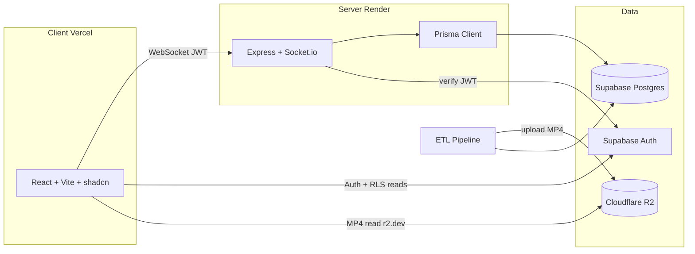
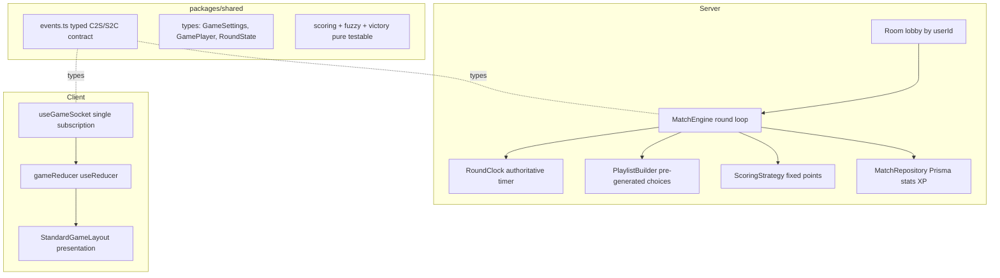

# AniQuizz Refactor Plan

Strategic refactor: keep solid business logic (song selection, fuzzy match, victory conditions, ETL pipeline, `packages/shared`, shadcn design system) but **rewrite the game engine** on healthy foundations (the old engine works but its foundations block features). Fresh repo, cleaned infra (R2 for media), and three finished features (XP, friends, leaderboard).

**Validated decisions:** new GitHub repo (`aniquizz`, old renamed `old-aniquizz`) / reuse Vercel + Render (Starter plan €7/mo, no cold-start) + Supabase + R2 creation / public `r2.dev` URL / regenerate catalogue via pipeline (no media migration) / Standard mode only (fixed points by answer type; AMQ-style speed mode later) / login required to play / keep Daily/Library placeholder pages as "coming soon" / mandatory review between each phase (commit + verify + pause).

**Local folders:** `old-AniQuizz/` = read-only reference · `aniquizz/` = new project workspace.

---

## Phase boundary protocol (mandatory)

At the end of each phase, **pause for review** before starting the next. Never start phase N+1 without explicit approval.

Checklist at every boundary:

1. **Phase checklist** — go through every item; mark done, partial, or deferred.
2. **Verify it still runs:**
   - `pnpm install` (if deps changed)
   - `pnpm build` (monorepo)
   - `pnpm dev` or targeted smoke test (`/health`, client loads, pipeline script if touched)
   - unit tests for the phase if already in place
3. **Git commit** — one commit per phase, clear message (`phase(N): 
`), only when explicitly requested at review (no mid-phase commits).
4. **Review summary** — what changed, how to test manually, watchouts, next phase.
5. **Pause** — wait for validation before phase N+1.

Branches: work on `main` or `refactor/phase-N-*`; confirm in Phase 0.

---

## Current engine diagnosis (to fix)

- Player identity keyed on `socket.id` (changes on reconnect) → lost scores, XP/friends/stats not reliably attachable. Root cause of most bugs.
- `any` and `@ts-ignore` everywhere (`settings: any`, dynamic props `timeTaken`/`wins`/`watchedIds`).
- God object `GameCore` (~520 lines: lobby + playlist + timers + votes + anilist + scoring + persistence), victory logic duplicated between `GameCore` and `StandardGame`.
- Anti-cheat leak: player answers broadcast to the whole room during guess; no answer lock.
- QCM variety bug: `prisma.anime.findMany({ take: 60 })` is not random and runs every round.
- Doubled DB queries in cascade + biased shuffle (`sort(() => 0.5 - Math.random())`).
- Client `Game.tsx` = god component (530 lines, ~40 `useState`, socket listeners re-subscribed every round → stale closures).
- Socket events = magic strings duplicated client/server, untyped.
- Finished matches never removed from `GameManager` memory.

---

## Target architecture

---

## Phase 0 — New repo & foundations

- Create empty GitHub repo via MCP (`aniquizz`).
- Monorepo structure pnpm + Turborepo (`apps/client`, `apps/server`, `packages/shared`, `packages/database`).
- Copy ONLY solid bricks: `packages/shared`, `packages/database` (schema + scripts), Standard server classes, `apps/client/src/components/ui`, features `auth`/`home`/`profile`, design system (`index.css`, tokens).
- Pro docs: `README.md`, `ARCHITECTURE.md`, `CONTRIBUTING.md`, `LICENSE`, `.env.example` per app.
- Unify Prisma to `6.x` everywhere (server 5.10.2 vs database 6.19.2 today).
- Initialize versioned Prisma migrations (`prisma migrate dev`) **as soon as schema lands** — initial schema under version control from commit 1 (no unversioned `db push`). Schema cleanup in Phase 4 via new migrations.
- Clean `.gitignore` + shared lint/format config.
- Fix broken `description` in `packages/database/package.json`.
- Easy dev workflow: single `pnpm dev`, complete `.env.example`, deterministic test-account seed (advanced test tooling in Phase 6).

**Cross-cutting convention (from now):** all code in English (identifiers, comments, logs, docs, commits); user-facing UI text stays French, isolated (i18n-ready). Lint rule + anti-French grep in CI (Phase 9).

---

## Phase 1 — Infra & R2 migration

- Cloudflare R2 (MCP): bucket `aniquizz-videos`, public `r2.dev` URL, S3 API keys.
- Adapt `packages/database/scripts/4_sync_storage.ts`: Supabase Storage → S3 client (`@aws-sdk/client-s3`, endpoint `https://<account>.r2.cloudflarestorage.com`, region `auto`). Env: `R2_ACCOUNT_ID`, `R2_ACCESS_KEY_ID`, `R2_SECRET_ACCESS_KEY`, `R2_BUCKET`, `R2_PUBLIC_URL`. Replace `.list` existence check with `HeadObject`; build `r2.dev` public URL.
- Adapt `packages/database/scripts/reset_all.ts`: empty R2 via `ListObjectsV2` + `DeleteObjects`.
- Pipeline improvements: parallelize worker with `p-limit`, `RESET_ERRORS_ON_START` as env flag, clarify `videoKey` (storage key) vs `sourceUrl` (AnimeThemes URL) — step 2 currently sets `videoKey: sourceUrl`.
- Keep JSON ETL approach (`data_step1/2.json` gitignored intermediates, versioned `manual_edits.json` with `isLocked`, `animethemes_cache.json`); add zod validation on load if possible. Pipeline runs locally (Render ephemeral FS not affected).
- Client: remove hardcoded Supabase URL in `Game.tsx` → `VITE_R2_PUBLIC_URL`.
- Deployments (MCP Vercel/Render): clean existing projects, align env vars, fix CORS/port mismatch (`5173` vs `8080`).
- Render Starter plan (€7/mo): no sleep, no cold-start — required for Socket.io realtime.
- Regenerate catalogue on R2 via `global_build.ts` after worker adaptation.

---

## Phase 2 — Security & identity

- Supabase JWT validation on server: Socket.io middleware in `SocketManager.ts` verifying `socket.handshake.auth.token` (JWT secret or `supabase.auth.getUser`) — never trust raw `userId`. Output: `socket.data.userId` as canonical identity.
- Login required to play: reject unauthenticated sockets on game actions; gate `/play` and `/game` client-side (redirect to login modal).
- Rate limiting on sensitive socket events (`game:answer`, `chat:sendMessage`, `lobby:create`).
- Boot-time env validation (zod) client + server; centralize all URLs in env vars.
- Review Supabase RLS on client-read tables (`Profile`, `SongHistory`).
- Remove dead deps (`@tanstack/react-query` unused on client).

---

## Phase 3 — Observability, logs & debug (pro level)

Goal: see full lobby/match/player story in console/logs, trace every crash and every player action. Done **before** cleanup so visibility helps cleanup and engine rewrite.

Current `logger.ts` issues: file logs in `logs/` (lost on Render), non-queryable text, no correlation, no global crash handlers, room password leak via `safeStringify(settings)`.

- Migrate to **pino**: structured JSON in prod (Render stdout), `pino-pretty` in dev. No file writes in prod.
- Child logger: `logger.child({ context, userId, roomId, matchId })` — queryable fields.
- Auto-instrument socket events: log every inbound event (name, actor `userId`, sanitized payload) + critical outbound emits.
- Structured lifecycle logs: lobby create/join/leave/host transfer/settings; match start / round start / answer / reveal / end; connect/disconnect/reconnect.
- Global crash handlers: `uncaughtException`, `unhandledRejection`, Socket.io errors — full stack + context.
- Error taxonomy: `LobbyError`, `GameError`, `ValidationError` with codes.
- Redaction: never log JWT or room passwords.
- Monitoring abstraction: `utils/errorReporter.ts` → `captureError(err, context)` calls `logger.error` for now; single file to wire Sentry later (not now).
- Client: React `ErrorBoundary` + reporter for uncaught errors and `connect_error`, gated by debug env flag.
- Enriched `/health` (uptime, active rooms, connected players).

---

## Phase 4 — Code cleanup (Standard mode only)

- Server: remove `ChallengerGame.ts`, `TimeTrialGame.ts`, all Battle Royale/Rush references; keep `GameCore` + `StandardGame` until Phase 5 rewrite.
- Client: remove `modes/challenger`, `modes/time-trial`; keep `modes/standard`.
- `packages/shared`:
  - `constants.ts`: remove `CHALLENGER`, `TIME_TRIAL`, `BATTLE_ROYALE`; keep SCORING/VICTORY/TIMERS/FUZZY/DECADES/LIMITS/RANKS/COLLECTION_RANKS/PLAYLISTS.
  - `types.ts`: `GameConfig.gameType` → `'standard'` only; remove `livesCount`/`startingTime`/BattleRoyale types and BR fields on `GamePlayer`.
  - `utils.ts`: keep pure functions; unify `getRank` with `RANKS`; type `getFuzzySuggestions`; consolidate Levenshtein implementations.
- Prisma cleanup via **new versioned migration** (`SongVote` unused; decide fate of `GameSession`/`GameParticipant`).
- Keep Daily/Library/Competitive placeholder pages.

---

## Phase 5 — Game engine rewrite (Standard mode)

Rebuild engine on healthy foundations; reuse business logic (song selection, fuzzy, victory), do **not** copy old `GameCore` structure.

- Identity: players keyed by `userId` (JWT); `socketId` mutable → reliable reconnect via `getSyncState`.
- Strict types + typed socket contract (`Server<ClientToServer, ServerToClient>`) shared both sides.
- Separation: `Room` / `MatchEngine` / `PlaylistBuilder` / `ScoringStrategy` / `MatchRepository` — no god object, no duplicated victory logic.
- Anti-cheat: during guess broadcast only "has answered" boolean; reveal answers at reveal only; answer lock + rate-limit.
- Scoring: fixed points by answer type (typing/QCM/duo); isolated in `ScoringStrategy` for future AMQ speed mode.
- Selection: truly random QCM pool, pre-generate all round choices at match start, Fisher-Yates in `shared`, merge doubled cascade queries.
- Lifecycle: remove finished matches from memory (grace period); decouple `gameHandlers` from `index.ts` singleton.
- Client: replace god `Game.tsx` with `useGameSocket` + `useReducer` + presentation-only `StandardGameLayout`.
- **Colocated unit tests (Vitest)** as pure logic is ported: fuzzy, `ScoringStrategy`, Fisher-Yates, victory solo/multi, song selection — highest value/effort ratio.

---

## Phase 6 — Dev environment, test tooling & Admin

After engine rewrite — make testing features/UI easy.

**Dev & test tooling:**

- Simulated players (**DEV ONLY**): server-side bots join rooms and auto-answer (configurable speed/accuracy) → test multiplayer alone. Disabled in production (env guard).
- Dev auth: auto-login / quick switch between seeded test accounts.
- Scripted scenarios ("create room + N bots + start match") from admin or CLI.

**Full Admin mode** (`/admin`, role-gated route, **server-side** role check from DB — never trust client):

- Users: list/search, change role (USER/MODERATOR/ADMIN), ban/mute, reset stats.
- Live rooms/matches: view active state (`GameManager`), force-end match, kick player, close room.
- Catalogue: moderate songs (difficulty, disable broken song, view worker errors).
- Tools: trigger bots/scenarios, live server stats from `/health`.
- Admin UI functional first; visual polish in Phase 8.

---

## Phase 7 — Features

- **XP / Level:** level curve + XP calc in `packages/shared` (pure + unit tests); persist in `saveGameHistory`; profile/header bar + level-up event.
- **Friends:** Prisma `Friendship` model; server `friends` module (request/accept/reject/remove, online presence); UI panel + lobby invite.
- **Leaderboard:** server `leaderboard:get` querying `Profile` by XP/level and wins; replace mock data in `Leaderboard.tsx`.

---

## Phase 8 — UI/UX rework

After engine (Phase 5) and features (Phase 7). Mature visual identity; organic debt (god-components, ~70% dead shadcn).

**KEEP:** dark design system, Home → GameHub → Game → GameOver flow, game components (`CircularGameTimer`, `PlayerCard*`, `SongInfoCard`, `GameSidebar`, etc.), Auth/Profile/Hub, `UserAvatar`, `StatCard`.

**IMPROVE:** refactor `GameHub` (`useLobbySocket`), light mode toggle + remove hardcoded `text-white`, unify `AuthModal`, route guards, `NotFound`, a11y, DRY news display.

**DELETE:** ~35 unused shadcn components, dead `NavLink`, unused `ui/sonner`, fake "online" badge on profile.

Note: `Game.tsx` refactor is Phase 5; this phase covers the rest of the client.

---

## Phase 9 — Integration tests, e2e & CI

Unit tests already colocated in Phases 5–7. This phase adds higher levels + automation.

- Server integration: key socket handlers via test `socket.io-client` (Phase 6 bots help script scenarios).
- Client component tests (Testing Library) on critical flows.
- e2e (Playwright): create match → play one round → game over.
- GitHub Actions: `lint` + `test` + `build` on PR (Turbo cache); README badges.
- CI "English code" check: lint + grep excluding isolated French UI strings.

---

## MCP execution notes

- MCP available: GitHub repo, Vercel, Render, Cloudflare R2.
- Some steps remain manual (OAuth, secret entry): step-by-step guidance at the time.
